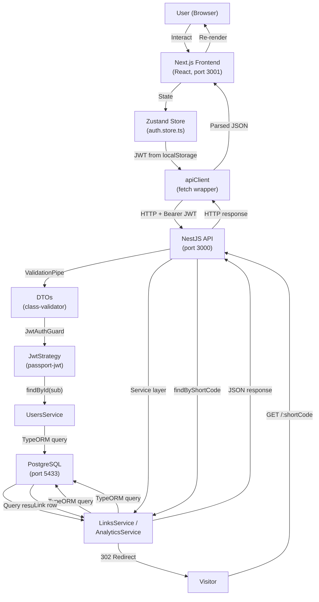
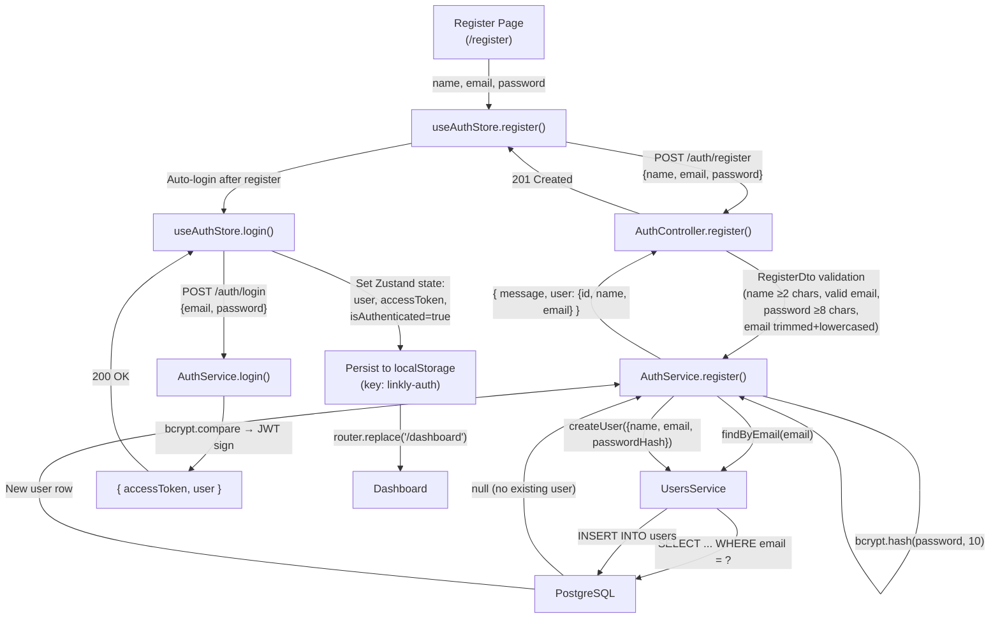
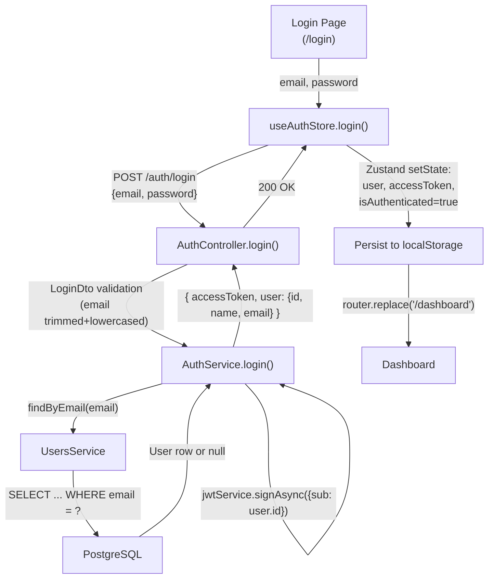
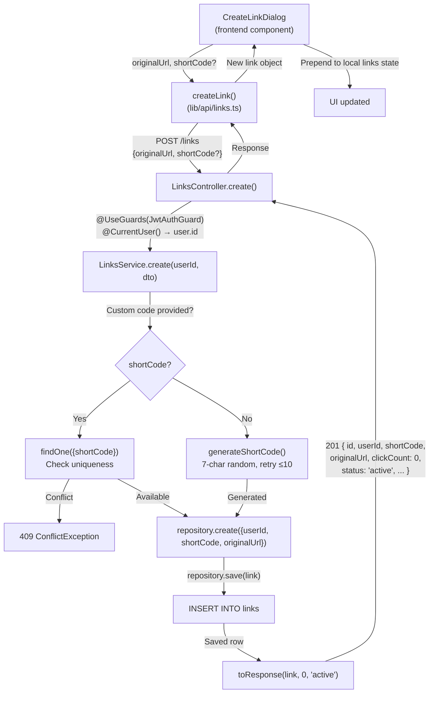
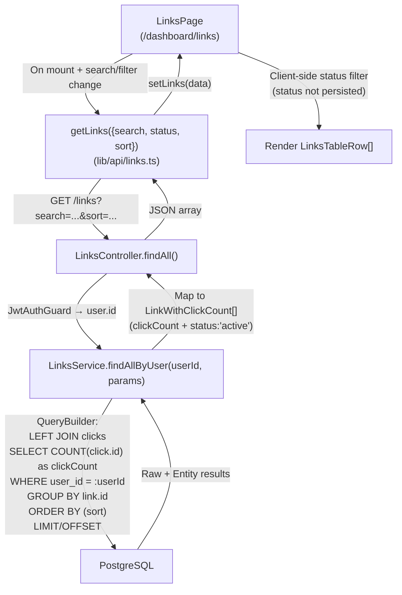
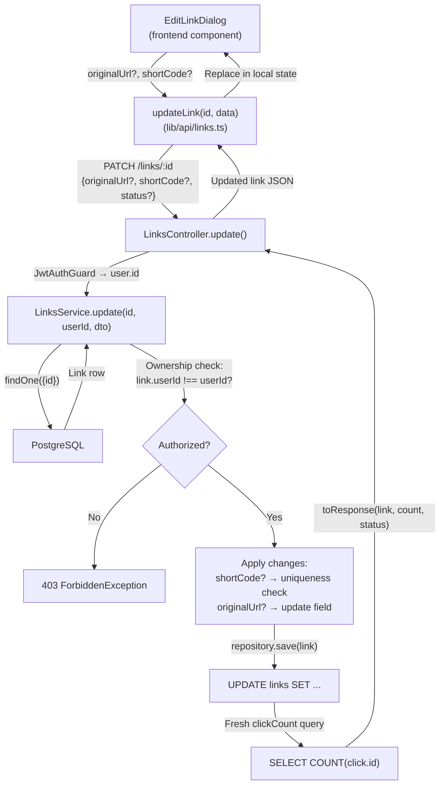
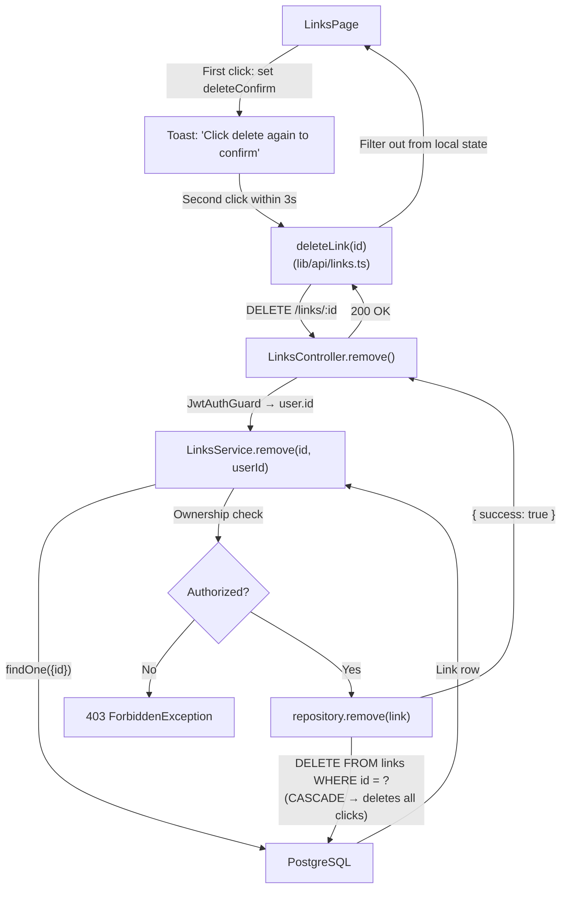
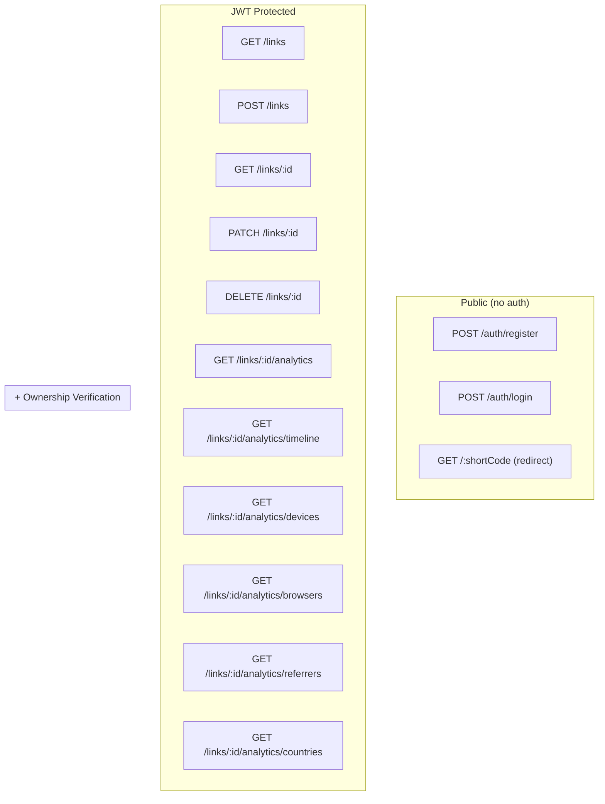

# Data Flow

## 1. Overview

Data flows through a standard SPA architecture:

1. **Frontend** (Next.js App Router, client-side React) — user interaction, form state, API calls.
2. **API Client** (`apiClient` fetch wrapper) — attaches JWT Bearer token, sends JSON to the backend.
3. **Backend** (NestJS REST API) — validates input via DTOs, authenticates via JWT guard, performs business logic, queries/mutates the database.
4. **Database** (PostgreSQL via TypeORM) — persists users, links, and clicks.
5. **Response** — JSON flows back through the same chain to the UI.

There are no WebSocket connections, no server-sent events, no background jobs, no message queues, and no external third-party service integrations in the current implementation.

---

## 2. System-Level Data Flow



---

## 3. Authentication Flow

### Registration



**Source:** [`frontend/src/app/register/page.tsx`](file:///Users/ashrafulasif/My%20projects/Link-Shortner/frontend/src/app/register/page.tsx) lines 26–37

### Login



**Source:** [`frontend/src/app/login/page.tsx`](file:///Users/ashrafulasif/My%20projects/Link-Shortner/frontend/src/app/login/page.tsx) lines 25–34

### JWT Validation (per protected request)

```
1. apiClient reads accessToken from localStorage['linkly-auth'].state.accessToken
2. Attaches header: Authorization: Bearer <token>
3. NestJS JwtAuthGuard triggers JwtStrategy
4. JwtStrategy extracts + verifies JWT (HS256, checks expiry)
5. JwtStrategy.validate() calls UsersService.findById(payload.sub)
6. If user exists → sets request.user = safeUser (without passwordHash)
7. If user not found → throws UnauthorizedException
```

### Logout

```
1. User clicks logout (in Sidebar component)
2. useAuthStore.logout() → clears user, accessToken, isAuthenticated
3. Zustand persist removes token from localStorage
4. DashboardLayout detects isAuthenticated=false → router.replace('/login')
```

No server-side logout. No token invalidation.

---

## 4. Create Data Flow

### Create Short Link



**Source:** [`links.service.ts`](file:///Users/ashrafulasif/My%20projects/Link-Shortner/backend/src/links/links.service.ts) lines 43–69, [`CreateLinkDialog.tsx`](file:///Users/ashrafulasif/My%20projects/Link-Shortner/frontend/src/components/dashboard/CreateLinkDialog.tsx)

### Create Click (NOT IMPLEMENTED)

The `RedirectController.redirect()` at [`redirect.controller.ts`](file:///Users/ashrafulasif/My%20projects/Link-Shortner/backend/src/links/redirect.controller.ts) performs a `302` redirect but **does not** create a `Click` record. The `clicks` table is never written to by any current code path. This means all analytics data will be empty.

---

## 5. Read Data Flow

### List Links (Links Page)



**Source:** [`links/page.tsx`](file:///Users/ashrafulasif/My%20projects/Link-Shortner/frontend/src/app/dashboard/links/page.tsx) lines 31–47

### Dashboard Analytics (MOCK DATA)

The main dashboard page (`/dashboard/page.tsx`) imports `mockDashboardData` from `frontend/src/lib/mock-dashboard-data.ts` and passes it directly to all chart/stat components. **No API calls are made.** The analytics API endpoints exist in the backend and the frontend API layer (`lib/api/analytics.ts`) but they are not used on the dashboard page.

### Analytics API Endpoints (Backend implemented, not wired to dashboard UI)

```
GET /links/:id/analytics           → AnalyticsService.getSummary()
GET /links/:id/analytics/timeline  → AnalyticsService.getTimeline()
GET /links/:id/analytics/devices   → AnalyticsService.getDevices()
GET /links/:id/analytics/browsers  → AnalyticsService.getBrowsers()
GET /links/:id/analytics/referrers → AnalyticsService.getReferrers()
GET /links/:id/analytics/countries → AnalyticsService.getCountries()
```

Each endpoint validates link ownership then runs aggregate queries against the `clicks` table.

---

## 6. Update Data Flow

### Update Link



**Note on `status`:** The `UpdateLinkDto` accepts `status: 'active' | 'disabled'` and the service passes it to `toResponse()`, but `status` is **not persisted** — there is no `status` column in the `links` table. The returned status is whatever was passed in the DTO (or defaults to `'active'`).

---

## 7. Delete Flow

### Delete Link



**Hard delete only.** No soft-delete, no trash, no recovery.

---

## 8. External Services

No external service integrations were verified. Specifically:

- No email service (no verification emails, no password reset emails).
- No analytics services (e.g., Google Analytics, Mixpanel).
- No payment/billing services.
- No IP geolocation API (the `country` field on `clicks` is defined but never populated).
- No user-agent parsing library (the `device`, `browser` fields on `clicks` are defined but never populated).

---

## 9. File / Storage Flow

No file upload, download, or object storage flows exist in this project. All data is text-based and stored in PostgreSQL.

---

## 10. Realtime / Background Flow

No realtime or background processing mechanisms were found:

- No WebSocket connections.
- No Server-Sent Events.
- No message queues (Bull, RabbitMQ, etc.).
- No cron jobs or scheduled tasks.
- No background workers.
- No webhooks (inbound or outbound).

All operations are synchronous request-response.

---

## 11. Security Boundaries



**Boundary details:**

| Boundary | Where applied | Mechanism |
|----------|--------------|-----------|
| CORS | `main.ts` | `app.enableCors({ origin: FRONTEND_URL, credentials: true })` |
| Input validation | Global | `ValidationPipe` (whitelist, forbidNonWhitelisted, transform) |
| Authentication | Controller-level | `@UseGuards(JwtAuthGuard)` on LinksController, AnalyticsController |
| Authorization (ownership) | Service-level | `link.userId !== userId` → `ForbiddenException` |
| Password stripping | Strategy-level | `JwtStrategy.validate()` removes `passwordHash` |

**No rate limiting** is applied at any boundary.

---

## 12. Important Data Transformations

### Backend input transformations

| Transform | Location | Detail |
|-----------|----------|--------|
| Email normalization | `RegisterDto`, `LoginDto` | `@Transform` trims whitespace and lowercases email |
| Password hashing | `AuthService.register()` | `bcrypt.hash(password, 10)` before storage |
| Short code generation | `LinksService.create()` | Auto-generates 7-char alphanumeric if not provided |

### Backend output transformations

| Transform | Location | Detail |
|-----------|----------|--------|
| Password stripping | `JwtStrategy.validate()` | `const { passwordHash: _, ...safeUser } = user` |
| Click count computation | `LinksService.findAllByUser()`, `findOne()` | `LEFT JOIN clicks` + `COUNT(click.id)::int as clickCount` |
| Virtual status field | `LinksService.toResponse()` | Always adds `status: 'active'` (not from DB) |
| Analytics grouping | `AnalyticsService.*()` | `GROUP BY` with `COALESCE(..., 'Unknown')` for null handling |
| Date formatting | `AnalyticsService.getTimeline()` | `TO_CHAR(timestamp, 'YYYY-MM-DD')` for daily grouping |
| Cast to int | Various analytics queries | `COUNT(*)::int` to ensure numeric (not bigint string) return |

### Frontend input transformations

| Transform | Location | Detail |
|-----------|----------|--------|
| User initials | `Header.tsx` | Splits `user.name`, takes first letter of each word, uppercased, max 2 chars |
| Display name | `Header.tsx` | First word of `user.name`, or email prefix before `@` |

### Frontend output transformations

| Transform | Location | Detail |
|-----------|----------|--------|
| Short URL display | `LinksPage`, `LinksTableRow` | Concatenates `NEXT_PUBLIC_SHORT_URL` + `/${link.shortCode}` |
| Search debounce | `LinksPage` | 300ms `setTimeout` before firing search API call |

---

## 13. Unknown / Unverified Flows

1. **Click recording on redirect** — not implemented. `RedirectController` does not create `Click` records. The entire write path to the `clicks` table is absent.
2. **`POST /links/:id/disable`** — called by `frontend/src/lib/api/links.ts` `disableLink()` function, but this backend endpoint does not exist. The function appears to be dead code; the LinksPage uses `updateLink()` with `{ status }` instead.
3. **Analytics dashboard wiring** — `frontend/src/lib/api/analytics.ts` defines all API call functions, but the dashboard page (`/dashboard/page.tsx`) uses `mockDashboardData` instead. The real analytics API is not consumed by the UI.
4. **User-agent parsing** — the `clicks` entity has `device` and `browser` fields, but no user-agent parsing library (e.g., `ua-parser-js`) is installed or used anywhere.
5. **IP geolocation** — the `clicks` entity has a `country` field, but no geolocation service or library is installed or used.
6. **Logout data flow** — the Sidebar component triggers logout, but the Sidebar component's source was not inspected in detail. The store's `logout()` method clears state; the `DashboardLayout` redirect on `isAuthenticated=false` was verified.
7. **Password reset flow** — does not exist.
