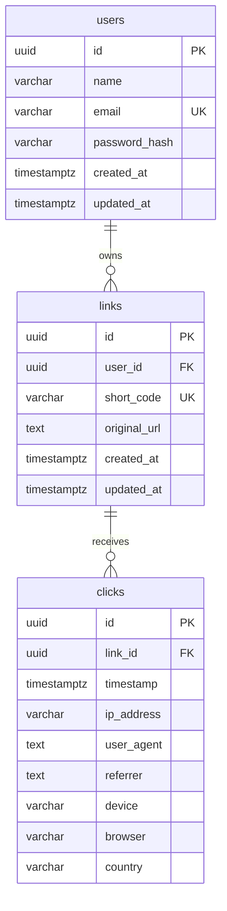

# Data Relationships

## 1. Relationship Overview

The Linkly data model has a simple three-entity hierarchy:

1. **users** — root entity. Every user owns zero or more links.
2. **links** — owned by exactly one user. Each link has zero or more click records.
3. **clicks** — belongs to exactly one link. Records a single visitor click event.

All relationships use UUID foreign keys with `ON DELETE CASCADE`, meaning:
- Deleting a user removes all their links and (transitively) all click data.
- Deleting a link removes all its click records.

There are no many-to-many relationships, no join tables, and no self-referential relationships in this project.

---

## 2. Entity Relationship Diagram



> **Note:** The `clicks.device`, `clicks.browser`, and `clicks.country` columns are defined in the TypeORM entity but are missing from the initial migration SQL. They are included in this diagram because they represent the intended schema as defined in the entity class.

---

## 3. Relationship Details

### users → links

| Aspect | Value |
|--------|-------|
| **Relationship** | One-to-many |
| **Cardinality** | One user has zero or many links |
| **Foreign key** | `links.user_id` → `users.id` |
| **Constraint name** | `FK_9f8dea86e48a7216c4f5369c1e4` |
| **On delete** | CASCADE (deleting a user deletes all their links) |
| **On update** | NO ACTION |
| **Purpose** | Associates each shortened link with its creator/owner |
| **Source (entity)** | [`user.entity.ts`](file:///Users/ashrafulasif/My%20projects/Link-Shortner/backend/src/users/entities/user.entity.ts) — `@OneToMany('Link', (link) => link.user)` |
| **Source (entity)** | [`link.entity.ts`](file:///Users/ashrafulasif/My%20projects/Link-Shortner/backend/src/links/entities/link.entity.ts) — `@ManyToOne('User', (user) => user.links, { onDelete: 'CASCADE' })` |
| **Source (migration)** | [`1790786897488-CreateInitialEntities.ts`](file:///Users/ashrafulasif/My%20projects/Link-Shortner/backend/src/database/migrations/1790786897488-CreateInitialEntities.ts) — `ALTER TABLE "links" ADD CONSTRAINT ... FOREIGN KEY ("user_id") REFERENCES "users"("id") ON DELETE CASCADE` |
| **Index** | `idx_links_user_id` on `links.user_id` |

---

### links → clicks

| Aspect | Value |
|--------|-------|
| **Relationship** | One-to-many |
| **Cardinality** | One link has zero or many clicks |
| **Foreign key** | `clicks.link_id` → `links.id` |
| **Constraint name** | `FK_3e477bfbdf3a572363b65bc4525` |
| **On delete** | CASCADE (deleting a link deletes all its click records) |
| **On update** | NO ACTION |
| **Purpose** | Associates each click event with the short link that was visited |
| **Source (entity)** | [`link.entity.ts`](file:///Users/ashrafulasif/My%20projects/Link-Shortner/backend/src/links/entities/link.entity.ts) — `@OneToMany('Click', (click) => click.link)` |
| **Source (entity)** | [`click.entity.ts`](file:///Users/ashrafulasif/My%20projects/Link-Shortner/backend/src/analytics/entities/click.entity.ts) — `@ManyToOne('Link', (link) => link.clicks, { onDelete: 'CASCADE' })` |
| **Source (migration)** | [`1790786897488-CreateInitialEntities.ts`](file:///Users/ashrafulasif/My%20projects/Link-Shortner/backend/src/database/migrations/1790786897488-CreateInitialEntities.ts) — `ALTER TABLE "clicks" ADD CONSTRAINT ... FOREIGN KEY ("link_id") REFERENCES "links"("id") ON DELETE CASCADE` |
| **Indexes** | `idx_clicks_link_id` on `clicks.link_id`, `idx_clicks_link_id_timestamp` on `(clicks.link_id, clicks.timestamp)` |

---

## 4. Authentication Relationships

| Aspect | Detail |
|--------|--------|
| **Identity source** | `users` table — `email` is the unique login identifier |
| **JWT `sub` claim** | Maps to `users.id` (UUID) |
| **Token validation** | `JwtStrategy.validate()` calls `UsersService.findById(payload.sub)` to load the user from DB |
| **Session storage** | No server-side sessions. JWT stored in browser `localStorage` (key: `linkly-auth`) |

There is no separate `sessions`, `tokens`, or `refresh_tokens` table. Authentication state exists entirely in the JWT and the `users` table.

---

## 5. Ownership Relationships

All data ownership flows from the `users` entity:

```
users
  └── links (via links.user_id → users.id)
        └── clicks (via clicks.link_id → links.id)
```

**Enforcement:**
- **Links:** Every `LinksService` method (create, findAllByUser, findOne, update, remove) verifies that `link.userId === requestingUser.id`. Mismatches throw `ForbiddenException`.
- **Analytics:** `AnalyticsService.validateLinkOwnership()` checks that the link exists and belongs to the requesting user before returning any analytics data.
- **Clicks:** Not directly accessed by users. Click data is only exposed through analytics aggregation endpoints that first validate link ownership.

Source:
- [`links.service.ts`](file:///Users/ashrafulasif/My%20projects/Link-Shortner/backend/src/links/links.service.ts) — ownership checks in every method
- [`analytics.service.ts`](file:///Users/ashrafulasif/My%20projects/Link-Shortner/backend/src/analytics/analytics.service.ts) — `validateLinkOwnership()`

---

## 6. Dependency Relationships

### Cascade deletion chain

```
DELETE users.id = X
  → CASCADE DELETE all links WHERE user_id = X
    → CASCADE DELETE all clicks WHERE link_id IN (deleted link IDs)
```

This means deleting a user account removes all their links and all associated click analytics permanently. There is no soft-delete mechanism.

### Query-time relationships used in the codebase

| Query | Relationship used | Source |
|-------|-------------------|--------|
| `LinksService.findAllByUser()` | `LEFT JOIN link.clicks` to compute `clickCount` per link | [`links.service.ts`](file:///Users/ashrafulasif/My%20projects/Link-Shortner/backend/src/links/links.service.ts) line 76 |
| `LinksService.findOne()` | `LEFT JOIN link.clicks` for click count | Same file, line 117 |
| `AnalyticsService.getSummary()` | `clicks WHERE link_id = :linkId` with time-range filters | [`analytics.service.ts`](file:///Users/ashrafulasif/My%20projects/Link-Shortner/backend/src/analytics/analytics.service.ts) line 44 |
| `AnalyticsService.getTimeline()` | `clicks WHERE link_id = :linkId` grouped by date | Same file, line 84 |
| `AnalyticsService.getDevices()` | `clicks WHERE link_id = :linkId` grouped by `device` | Same file, line 102 |
| `AnalyticsService.getBrowsers()` | `clicks WHERE link_id = :linkId` grouped by `browser` | Same file, line 120 |
| `AnalyticsService.getReferrers()` | `clicks WHERE link_id = :linkId` grouped by `referrer` | Same file, line 138 |
| `AnalyticsService.getCountries()` | `clicks WHERE link_id = :linkId` grouped by `country` | Same file, line 156 |

---

## 7. Unverified Relationships

1. **No additional entities found.** There are no `sessions`, `api_keys`, `organizations`, `teams`, `tags`, `categories`, or any other tables beyond `users`, `links`, and `clicks`.
2. **No many-to-many relationships exist** in this project.
3. **No cross-database or external data store relationships** were found.
4. **TypeORM uses string-based relation references** (e.g., `@ManyToOne('User', ...)` instead of direct class references with `() => User`). This is to avoid circular import issues. The relationships are verified correct via the migration SQL foreign key constraints.
